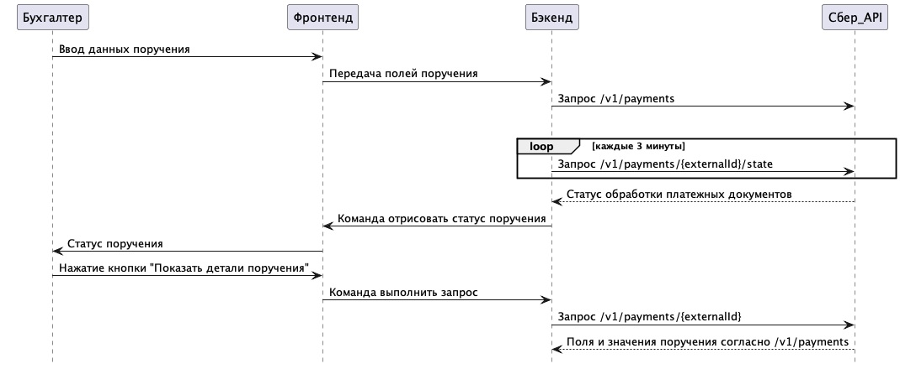

# Создание платёжного поручения

Корпоративная система управления ресурсами (ERP) Компании требует возможности автоматического создания и отправки платёжных поручений для упрощения процессов бухгалтерии и управления финансами. 

Интеграция метода [создания платёжных поручений](https://developers.sber.ru/docs/ru/sber-api/host/rpp/payments) через API Сбера позволит автоматизировать процесс обработки и отправки платежей поставщикам и партнёрам.

## Преимущества для клиента и бизнеса
Для клиентов:

  - Автоматизация процесса создания и отправки платёжных поручений.
  - Снижение риска ошибок при ручном вводе данных.
  - Удобный и быстрый способ управления платежами.

Для бизнеса:

  - Повышение эффективности и производительности бухгалтерского отдела.
  - Улучшение контроля и прозрачности финансовых операций.
  - Снижение затрат на обработку платежей за счёт автоматизации.

## Пользовательский сценарий

### Создание платёжного поручения:
1. Бухгалтер вводит данные о новом платеже на фронтенеде системы ERP. О том, какие данные поддерживаются см. [здесь](https://developers.sber.ru/docs/ru/sber-api/host/rpp/payments#model-zaprosa-i-otveta28).
1. Фронтенд ERP-системы передаёт введённые данные бэкенду.
1. Бэкенд ERP-системы автоматически генерирует платёжное поручение на основе введённых данных и отправляет его API Сбера.

### Отправка платёжного поручения
1. Бэкенд системы отправляет запрос [/payments](https://developers.sber.ru/docs/ru/sber-api/host/rpp/payments#sozdanie-platezhnyh-porucheniy2) на создание платёжного поручения через API Сбера.
1. Для получения статусa запроса на создание платежного поручения бэкенд системы отправляет запрос [/v1/payments/{externalId}/state](https://developers.sber.ru/docs/ru/sber-api/host/rpp/payments#poluchenie-statusa-porucheniya3) на создание платёжного поручения через API Сбера.
1. API возвращает [статус поручения](https://developers.sber.ru/docs/ru/sber-api/host/rpp/payments#statusy-obrabotki-platezhnyh-dokumentov2) и, при наличии информации, ошибки, которые нужно исправить.

### Проверка статуса платёжного поручения:
1. Бэкенд ERP-системы периодически проверяет статус отправленного платёжного поручения, отправляя запрос [/v1/payments/{externalId}/state](https://developers.sber.ru/docs/ru/sber-api/host/rpp/payments#poluchenie-statusa-porucheniya3) в Сбер API.
1. Бухгалтер получает уведомления о статусе платежа (например, платёж успешно выполнен, платёж в ожидании, платёж отклонён) на фронтенде ERP-системы.
1. При необходимости получить атрибуты отправленного ранее поручения, бухгалтер на фронтенде системы нажимает кнопку "Показать детали поручения" при этом фронтенд системы отправляет команду бэкенду.
1. Бэкенд системы отправляет запросу [https://developers.sber.ru/docs/ru/sber-api/host/rpp/payments#poluchenie-atributov-porucheniya2](https://developers.sber.ru/docs/ru/sber-api/host/rpp/payments#poluchenie-atributov-porucheniya2)

### Обработка результатов:
1. При успешном выполнении платежа, система обновляет статус счета в ERP и отмечает его как оплаченный.
1. В случае [ошибок](https://developers.sber.ru/docs/ru/sber-api/host/rpp/payments#kody-vozvrata53), бухгалтер получает на фронтенде уведомление с детальной информацией о проблеме и возможных действиях для её устранения.

## Заключение
Интеграция метода создания платёжных поручений через API Сбера в корпоративную ERP систему позволяет значительно улучшить процесс управления платежами, повысить эффективность бухгалтерских операций и обеспечить высокий уровень безопасности и контроля финансовых транзакций.

Подробнее о реализации интеграции метода создания платежных поручений читайте [документацию Сбер API](https://developers.sber.ru/docs/ru/sber-api/host/rpp/payments).